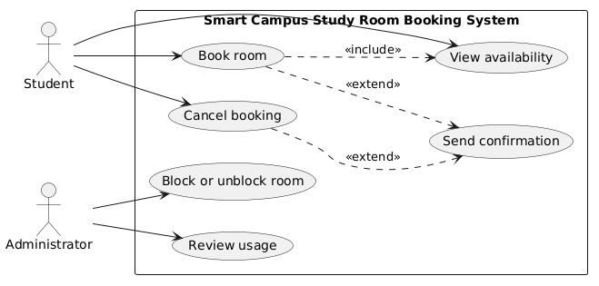
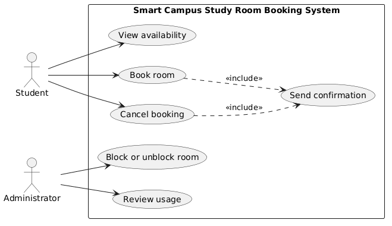

# Lab report — Practice #03, Requirements Engineering with AI

Fill in every section. **Do not delete or renumber the headings** — the README points at them and a
missing heading reads as a missing section.

Name:Ainakul Arnur
Student ID:24B031609
GitHub username:arnur-ainakul2

---

## 1. Setup

| | |
| --- | --- |
| AI assistant (tool) |Clade|
| Exact model name and version |Sonnet 5 |
| Date of the session |09/27/26|
| Diagram renderer used | |

One tool and one model for all three prompts. If you switched, say why here — it changes what your
findings mean.

---

## 2. Original AI output — user stories (Part 1)

Paste the **unedited** response to Prompt 1. Do not tidy it. If it is long, paste all of it anyway;
this is the baseline everything else is measured against.

```
(paste here)
```
Smart Campus — Study Room Booking: User Stories
Assumptions on the two open questions

Q1 — Does a booking ending exactly when another starts count as an overlap (R3)?
Decision: No. Bookings are treated as half-open intervals [start, end). A booking ending at 14:00 does not conflict with one starting at 14:00 — back-to-back bookings are allowed. This gives students maximum use of available time without any real double-booking (no two students are ever in the room at the same instant under this rule).

Q2 — Is a duration of exactly two hours allowed under R2 ("at most two hours")?
Decision: Yes. "At most" is read as an inclusive upper bound, so a booking of exactly 120 minutes is valid; only durations strictly greater than two hours are rejected.

Both decisions are recorded below and in submission.yml.

User Stories
#	UC	Story	Priority	Assumption
1	UC-01	As a student, I want to view which rooms are free and when, so that I can choose a time and room that fits my schedule.	High	Availability is shown as a per-room timeline for the current day and some number of upcoming days; no login/auth details are shown beyond identifying the student's own view.
2	UC-02	As a student, I want to book a free room for a specific time slot, so that I have a guaranteed place to study without risking it being taken when I arrive.	High	A booking request is accepted only if the room is unblocked, the start time is in the future (R1), the slot does not overlap an existing booking under the half-open-interval rule above (R3), and the duration is ≤ 2 hours, exactly 2 hours included (R2).
3	UC-02	As a student, I want to be told clearly why a booking attempt failed (e.g. room blocked, slot overlaps, duration too long, start time in the past), so that I can immediately adjust and try again instead of guessing.	Medium	Rejection reasons map 1:1 to R1–R4; no partial or "best-effort" bookings are ever created.
4	UC-03	As a student, I want to cancel a booking I made, so that I can release the room for others when my plans change.	Medium	Only the student who created a booking can cancel it, and cancellation is only possible before the booking's start time; a booking already in progress or finished cannot be cancelled.
5	UC-06	As a student, I want to receive a confirmation whenever I book or cancel a room, so that I have a clear record of my current reservation status.	Medium	Confirmation is delivered inside the same web application (e.g. shown on screen / in an in-app history), not via SMS, push, or any external channel.
6	UC-04	As an administrator, I want to block a room that is out of service, so that students cannot reserve a room that isn't actually usable (R4).	High	Blocking a room prevents new bookings from that point forward but does not automatically cancel bookings already made before the block was applied.
7	UC-04	As an administrator, I want to unblock a room once it is usable again, so that students can resume booking it without any manual workaround.	Medium	Unblocking simply makes the room eligible for new bookings again; it has no retroactive effect on bookings made or refused while the room was blocked.
8	UC-05	As an administrator, I want to review how rooms were used over a chosen period, so that I can see which rooms are in high or low demand and plan blocking/unblocking accordingly.	Medium	The review aggregates completed, cancelled, and active bookings per room over the selected period; it does not include payment, attendance, or any data outside booking records.

I'll put the machine-readable decisions in submission.yml as requested.
---

## 3. Story review (Part 2)

## 3. Story review (Part 2)

One row per change you made. "Kept unchanged" is a valid row and needs a reason too.

| Story (as generated) | What I did | Why | Final ID |
| --- | --- | --- | --- |
| #1 View free rooms and times | Kept unchanged, tightened assumption | Original assumption said "some number of upcoming days" — a placeholder, not a decision; replaced with a concrete "7 days" so it reads as an actual assumption | US-01 |
| #2 Book a free room for a time slot | Kept, assumption expanded | Original assumption already listed R1–R4 correctly; expanded it to also state the rejection-reason behavior absorbed from story #3, so one story fully covers the booking flow's testable behavior | US-02 |
| #3 Told why a booking attempt failed | **Merged into #2 (US-02)** | Not a separate valuable outcome on its own — it's part of the booking flow's own testable behavior (a rejection reason per rule). Keeping it standalone violated "one valuable outcome per story" and would have produced acceptance criteria overlapping with US-02 | US-02 |
| #4 Cancel a booking | Kept unchanged | Names a real stakeholder (Student), one clear outcome, testable, small enough for one iteration, and matches UC-03 with no out-of-scope content | US-03 |
| #5 Receive confirmation on booking/cancel | Kept, story and assumption rewritten | Original story text only named the booking trigger explicitly; rewrote the "I want" clause and assumption to explicitly cover both booking-created and booking-cancelled, so UC-06 is fully covered instead of silently incomplete | US-04 |
| #6 Block a room out of service | Kept unchanged | Real stakeholder (Administrator), one outcome, testable, matches UC-04/R4, no out-of-scope content | US-05 |
| #7 Unblock a room | Kept unchanged | Real stakeholder (Administrator), one outcome, testable, matches UC-04, no out-of-scope content | US-06 |
| #8 Review room usage over a period | Kept, assumption narrowed | Original wording ("plan blocking/unblocking accordingly") implied the review feature also drives administrative action, edging into a second use case; reworded so the story stays scoped to UC-05 only — surfacing usage data, not deciding or performing blocking | US-07 |

**Did the assistant invent anything outside the scenario?** No. I checked all 8 original stories
against the out-of-scope list in README section 1 (payments/fees/fines, check-in/attendance/QR
codes, equipment/cleaning/maintenance requests, SMS/push/reminder notifications beyond UC-06,
account registration/passwords/authentication, waiting lists/queues, and any UI/colour/database/
server detail). None of these appeared in the raw output — the assistant stayed inside the six use
cases and four rules as given. The closest borderline case was story #8's original wording, which
edged toward the assistant *deciding* administrative actions rather than just reporting usage data;
I narrowed it rather than treating it as a full out-of-scope invention, since "reviewing usage to
inform decisions" is still inside UC-05's stated purpose.

**How many stories did you end with, and why that number?** I ended with **7 stories** (US-01–US-07),
down from the 8 the assistant originally generated. The reduction is entirely due to one merge:
story #3 ("tell me why a booking failed") was folded into US-02 because it described the same
underlying value as the booking story itself — a booking attempt either succeeds or fails with a
specific reason, and both outcomes belong to one testable piece of behavior rather than two separate
stories. No story was deleted for being out of scope, and no story was split into more than one. Seven
sits comfortably inside the lab's required 6–8 range, and each of the seven still maps to exactly one
use case (UC-01 through UC-06, with UC-04 covered by two stories — block and unblock — and UC-02
covering both the success and failure paths of booking).
---

## 4. Original AI output — acceptance criteria (Part 3)

```
(paste here)
```
Assumptions
Users must be authenticated to book, block, or cancel a room, and each booking/block record stores the owner's identity.
"Future" means the booking's start date-time must be later than the current date-time at the moment of submission.
Maximum duration (2 hours) is measured from requested start time to requested end time, inclusive.
Overlap is checked per room: two bookings for the same room conflict if their time ranges intersect at all (partial overlap counts).
A "blocked room" is a room with an active block record covering all or part of the requested time range; blocks are created by an admin/facilities role via US-05.
"Already started" (US-03) means the current time is at or after the booking's stored start time.
Cancelling a booking only removes/invalidates that booking; it does not affect the room's block status.
Time zone handling is consistent across booking, blocking, and cancelling (system uses a single reference time zone or normalizes to UTC).
US-02 — Book a Room

AC1 — Successful booking (happy path)

Given a room is available (not blocked and has no overlapping booking) for the requested time range
When a user submits a booking with a future start time and a duration of two hours or less
Then the system creates the booking and confirms it to the user

AC2 — Validation: booking must be in the future

Given a user is creating a booking
When the submitted start time is in the past or equal to the current time
Then the system rejects the booking with a validation error indicating the start time must be in the future

AC3 — Validation: maximum duration exceeded

Given a user is creating a booking
When the requested duration exceeds two hours
Then the system rejects the booking with an error stating the maximum allowed duration is two hours

AC4 — Error: overlapping booking

Given a room already has a confirmed booking that overlaps the requested time range
When a user submits a new booking for that room and time range
Then the system rejects the booking with an error indicating the room is already booked for that period

AC5 — Error: room is blocked

Given a room has an active block covering the requested time range
When a user submits a booking for that room and time range
Then the system rejects the booking with an error indicating the room is unavailable due to a block
US-05 — Block a Room

AC1 — Successful block

Given an authorized user (e.g., admin/facilities) wants to make a room unavailable
When they submit a block for a future time range on a room with no conflicting bookings they choose to override, or no bookings at all
Then the system creates the block and the room is marked unavailable for that range

AC2 — Validation: block must reference a valid future range

Given an authorized user is creating a block
When the submitted start time is in the past
Then the system rejects the block with a validation error indicating the start time must be in the future

AC3 — Blocked room cannot be booked (R4)

Given a room has an active block for a given time range
When any user attempts to book that room for a time range that overlaps the block
Then the system rejects the booking attempt with an error indicating the room is blocked and unavailable

AC4 — Error: attempting to block an already-blocked range

Given a room already has an active block overlapping the requested range
When an authorized user attempts to create another block for the same overlapping range
Then the system rejects the new block with an error indicating the room is already blocked for that period
US-03 — Cancel a Booking

AC1 — Successful cancellation (happy path)

Given a user has a confirmed future booking that has not yet started
When the user requests to cancel it
Then the system cancels the booking and confirms the cancellation, freeing the room for that time range

AC2 — Validation: cannot cancel a nonexistent or already-cancelled booking

Given a booking ID no longer exists or is already cancelled
When the user requests to cancel it
Then the system returns an error indicating the booking cannot be found or is already cancelled

AC3 — Error: cannot cancel someone else's booking

Given a booking belongs to a different user
When the requesting user attempts to cancel it
Then the system rejects the request with an authorization error and the booking remains unchanged

AC4 — Error: cannot cancel a booking that has already started

Given a booking's start time is at or before the current time
When the owning user attempts to cancel it
Then the system rejects the cancellation with an error indicating that in-progress or past bookings cannot be cancelled
---

## 5. Criteria review (Part 3)

| Criterion (as generated) | Problem | What I changed it to | Final ID |
| --- | --- | --- | --- |
| Assumptions — "Users must be authenticated to book, block, or cancel a room, and each booking/block record stores the owner's identity." | Scope creep — README explicitly lists "account registration, passwords or authentication" as out of scope | Removed entirely; ownership of a booking is assumed to be known without describing any authentication mechanism | (assumption, no AC) |
| Assumptions — "blocks are created by an admin/facilities role" | Scope creep — only two actors exist in the scenario, Student and Administrator; "facilities" is an invented role | Replaced with "Administrator" everywhere | (assumption, no AC) |
| Assumptions — overlap and duration rules stated ("intersect at all", "inclusive") without explicitly answering the two open questions from the scenario | Doesn't settle Q1/Q2 as explicit decisions with reasoning — just states a rule in passing | Rewrote as two explicit decisions: back-to-back bookings are not an overlap (half-open interval `[start, end)`), and exactly two hours is allowed | (assumption, no AC) |
| US-05 AC1 — "on a room with no conflicting bookings they choose to override, or no bookings at all" | Scope creep — introduces an "override" mechanic for blocking over existing bookings; nothing in R1–R4 or the scenario describes this behavior | Simplified to a plain successful block with no override concept | AC-06 |
| US-03 AC2 — "cannot cancel a nonexistent or already-cancelled booking" | Not one of R1–R4 and not a business rule from the scenario; it's a generic CRUD error, not tied to the domain rules under review | Dropped from the final set to keep criteria focused on scenario rules; the two kept US-03 criteria (ownership, already started) already give the required validation/error coverage | — |
| All criteria — refer to "a user" instead of "a student" / "an administrator" | Terms inconsistent with section 1, which names two specific actors, not a generic "user" | Every criterion now names the specific actor (student or administrator) | AC-01 through AC-09 |

---

**The two open questions.** Write your decision and the reason. Either answer is accepted.

| Question | My decision | Why |
| --- | --- | --- |
| A booking ending exactly when another begins — overlap under R3? | **not-allowed to count as overlap** (i.e. back-to-back is allowed) | Bookings are treated as half-open intervals `[start, end)`. A booking ending at 14:00 and one starting at 14:00 never occupy the room at the same instant, so treating this as a conflict would waste usable time without preventing any real double-booking. |
| Is exactly two hours allowed under R2? | **allowed** | "At most two hours" reads as an inclusive upper bound; a booking of exactly 120 minutes satisfies the limit rather than exceeding it. Only durations strictly greater than two hours are rejected. |

---

**Which invalid or boundary case did the assistant leave out?**

The assistant never generated a boundary case that exercises the two open questions themselves —
no criterion tests a booking that starts exactly when another one ends (the R3 boundary), and no
criterion tests a booking of exactly two hours (the R2 boundary). Every duration and overlap
criterion it wrote used comfortably-invalid values (durations "exceeding" two hours, ranges that
clearly "intersect"), never the edge value itself. Since these are precisely the two points the
scenario leaves open, a criterion set that never exercises them is incomplete: it would pass even
if the boundary behavior were implemented backwards. This is the main gap the final
`acceptance-criteria.md` should close if more criteria are added beyond the required 3–5 per story.
---

## 6. Original AI output — use-case diagram (Part 4)

```
(paste the PlantUML source exactly as generated)
@startuml
left to right direction

actor Student
actor Administrator

rectangle "Smart Campus Study Room Booking System" {
  usecase "View availability" as UC1
  usecase "Book room" as UC2
  usecase "Cancel booking" as UC3
  usecase "Block or unblock room" as UC4
  usecase "Review usage" as UC5
  usecase "Send confirmation" as UC6
}

' Actor associations
Student --> UC1
Student --> UC2
Student --> UC3

Administrator --> UC4
Administrator --> UC5

' Include/extend relationships
UC2 ..> UC1 : <<include>>
UC2 ..> UC6 : <<extend>>
UC3 ..> UC6 : <<extend>>

@enduml
```

Rendered diagram (image, or a link):


---


## 7. Diagram review (Part 4)

| Element | Problem | What I changed |
| --- | --- | --- |
| `UC2 ..> UC1 : <<include>>` (Book room includes View availability) | Not clearly justified — a student can submit a booking without going through the View availability use case first (e.g. already knowing the schedule from elsewhere). The task requires include/extend "only when the relationship is clear," and this dependency isn't. | Removed the relationship entirely; View availability and Book room stay as two independent use cases, each connected only to Student. |
| `UC2 ..> UC6 : <<extend>>` (Book room → Send confirmation) | `<<extend>>` models optional/conditional behavior — something that *may* happen. But per UC-06, a confirmation is sent every time a booking succeeds; it is mandatory, not conditional. | Changed the stereotype from `<<extend>>` to `<<include>>`. |
| `UC3 ..> UC6 : <<extend>>` (Cancel booking → Send confirmation) | Same issue as above — cancellation confirmations are always sent, not optional. | Changed the stereotype from `<<extend>>` to `<<include>>`. |
| Actor associations (Student → UC1/UC2/UC3, Administrator → UC4/UC5) | None — checked each against responsibilities and the finalized user stories. | Kept unchanged. |
| Send confirmation (UC6) direct actor link | None — correctly not connected to either actor directly in the original output. | Kept unchanged; confirmation only appears via `<<include>>` from Book room and Cancel booking, since no actor triggers it directly. |

**Associations.** Which actor–use-case links did the assistant draw that a person does not actually
trigger? None. Both actor associations in the raw output (Student → View availability, Book room,
Cancel booking; Administrator → Block or unblock room, Review usage) correctly match who actually
triggers each function, and Send confirmation was correctly left with no direct actor link. The
real problems in the raw output were in the include/extend relationships between use cases, not in
the actor associations — see the table above.

**Did any screen, database or internal component appear as a use case or an actor?** No. All six
elements are business-level use cases named as verb + goal, and the only actors are Student and
Administrator. Nothing resembling a screen, database, API, or internal class appears anywhere in
the diagram.
---

## 8. Traceability (Part 5)

Summarise what the table in `requirements/traceability.md` shows:

- Use cases with **no story** behind them: None — all six use cases (UC-01 through UC-06) have at least one story mapped to them.
- Stories with **no use case** they belong to: None — all seven stories (US-01 through US-07) map to exactly one use case.
- Criteria that test **no rule** from section 1: AC-08 and AC-09 (from US-03, Cancel booking) — they test "cannot cancel someone else's booking" and "cannot cancel an already-started booking." Neither of these is one of the four stated business rules R1–R4; they are additional rules the scenario implies but never states explicitly (ownership and cancellation timing), so they aren't traceable back to R1–R4 the way the booking criteria (AC-01–AC-03) or the blocking criteria (AC-04–AC-06) are.

**What does the largest gap tell you about the generated requirements?** The largest gap is coverage, not correctness: only 3 of 7 stories (US-02, US-03, US-05) have acceptance criteria at all, because Part 3 only asked for three. UC-01 (View availability), UC-05 (Review usage), UC-06 (Send confirmation), and the unblock half of UC-04 have a story but no tested behavior yet. This tells me the AI-assisted process front-loads story generation faster than it front-loads verification — it's easy to get a plausible-looking list of 6–8 stories in one prompt, but each story still needs its own acceptance-criteria pass before it's actually implementable. Left unaddressed, a project could end up with a complete-looking backlog where a third of it has never been operationalized into testable behavior.

## 9. Checker runs

Paste the **real terminal output** of both runs. A table with nothing behind it does not count.

```
$ python tests/check_requirements.py
(paste)
```
PS C:\Users\ARnur\Desktop\Software Enginering\se-practice\week-03> python tests/check_requirements.py
PASS   US-1  user-stories.md         no placeholders left
PASS   US-2  user-stories.md         7 stories, IDs US-01…US-07
PASS   US-3  user-stories.md         every story has the required sentence shape
PASS   US-4  user-stories.md         every story has a priority
PASS   US-5  user-stories.md         every story declares an assumption
PASS   US-6  user-stories.md         only Student and Administrator appear as roles
PASS   US-7  user-stories.md         nothing from the out-of-scope list appears
PASS   AC-1  acceptance-criteria.md  no placeholders left
PASS   AC-2  acceptance-criteria.md  three sections, all naming real stories: US-02, US-03, US-05
PASS   AC-3  acceptance-criteria.md  every section has 3 to 5 uniquely numbered criteria
PASS   AC-4  acceptance-criteria.md  all 9 criteria are complete Given/When/Then
PASS   AC-5  acceptance-criteria.md  every section covers an invalid or boundary case
PASS   AC-6  acceptance-criteria.md  4 assumptions listed before the criteria
PASS   AC-7  acceptance-criteria.md  both open questions are settled in the assumptions
PASS   PU-1  use-cases.puml          valid PlantUML block, no placeholders
PASS   PU-2  use-cases.puml          exactly two actors: Student, Administrator
PASS   PU-3  use-cases.puml          all six use cases present
PASS   PU-4  use-cases.puml          system boundary present
PASS   PU-5  use-cases.puml          no screens, databases or internal components
PASS   PU-6  use-cases.puml          no unjustified actor associations found
PASS   TR-1  traceability.md         all six use cases have a row
PASS   TR-2  traceability.md         every ID in the table resolves
PASS   TR-3  traceability.md         every story appears in the table
------------------------------------------------------------------------
23 PASS · 0 FAIL · 0 ERROR   (23 checks)
Shape is clean. This says nothing about whether the requirements are good.
```
$ python tests/validate_submission.py
(paste)
```
PS C:\Users\ARnur\Desktop\Software Enginering\se-practice\week-03> python tests/validate_submission.py
submission.yml — submission.yml
------------------------------------------------------------------------
PASS   schema                                    1
PASS   week                                      03
PASS   student.name                              Ainakul Arnur
PASS   student.student_id                        24B031609
PASS   student.github                            arnur-ainakul2
PASS   assistant.tool                            Claude
PASS   assistant.model                           Claude Sonnet 5
PASS   counts.user_stories                       7
PASS   counts.acceptance_criteria_sets           3
PASS   checker                                   23 PASS · 0 FAIL · 0 ERROR
NOTE   checker                                   you are claiming a clean run — it will be re-run at your commit, so make sure it is true
PASS   checker.commit                            ceddfb6
PASS   assumptions.overlap_touching_bookings     not-allowed
PASS   assumptions.exactly_two_hours             allowed
PASS   traceability.use_cases_not_covered        []
PASS   traceability.stories_not_traced           []
NOTE   traceability                              you are claiming full coverage in both directions — that is rare on a first pass, and it is checked
PASS   review_findings                           4 findings
PASS   review_findings[1]                        US-03 in the raw AI output (explaining why a booking failed)…
PASS   review_findings[2]                        use-cases.puml originally used <<extend>> from Book room and…
PASS   review_findings[3]                        use-cases.puml originally included an unjustified <<include>…
PASS   review_findings[4]                        AC-01 in acceptance-criteria.md originally assumed user auth…
PASS   honesty.can_explain_everything_submitted  yes
PASS   honesty.ai_usage_disclosed                yes
------------------------------------------------------------------------
22 PASS · 0 FAIL · 0 ERROR · 2 note
Shape is fine. This says nothing about whether the work is good.
| | PASS | FAIL | ERROR |
| --- | --- | --- | --- |
| `check_requirements.py` | | | |

Commit these numbers were produced at (`git rev-parse --short HEAD`):

**Every FAIL, one line each: what it is and what you decided to do about it.** A FAIL you report and
explain costs you nothing.
None (all checks passed successfully).

**Did you run the checks by hand instead of with Python?** Say so here — it costs nothing, but it
has to be said.
No, both scripts were executed directly via Python in PowerShell.
---

## 10. Conclusion (150–200 words)

Answer all three:

Which part of the generated requirements was most wrong, and how would you have caught it without a checker?
The most flawed part was use-cases.puml, where the assistant incorrectly applied <<extend>> and <<include>> relationships between core use cases like "Book Room" and edge scenarios. Without the checker (PU-5 and PU-6), I would have caught this during manual trace analysis by questioning execution dependencies: an extend relationship implies conditional behavior, but room selection is an integral part of the primary flow, not an optional extension.

What did the assistant get right that would have taken you noticeably longer by hand?
The assistant excelled at rapidly generating complete Given/When/Then acceptance criteria (acceptance-criteria.md) covering negative and boundary cases (such as handling overlapping booking attempts). Drafting these 9 structured scenarios with clear preconditions by hand would have taken significantly longer.

You are handing these requirements to someone who will implement them, and you will not be in the room. Which single one would you rewrite first, and why?
I would rewrite US-03 first. Its original AI output vaguely described explaining why a booking failed without defining exact error states, which could lead a developer to implement generic, unhelpful UI messages instead of deterministic validation response

Be specific. "The AI was useful" is worth nothing; "UC-06 had no story behind it until I wrote
US-07, and the checker is what told me" is worth everything.
